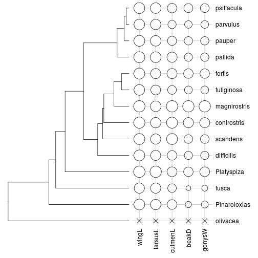

% `phylobase`
% François Michonneau - @FrancoisInvert
% iEvoBio -  June 24<sup>th</sup>, 2014


# Contributors

- Ben Bolker
- Marguerite Butler
- Peter Cowan
- Damien de Vienne
- Dirk Eddelbuettel
- Mark Holder
- Thibaut Jombart
- Steve Kembel
- David Orme
- Brian O'Meara
- Emmanuel Paradis
- Jim Regetz
- Derrick Zwickl
- **YOU?**

-------

## What `phylobase` is not

- a data analysis package

-------

## What `phylobase` provides

- classes + methods for object manipulation
- object = phylogenetic tree (+ data)
- robust
    - over 200 unit tests
	- S4 class
	
-------

## Why `phylobase`?

- `phylo4` as the unifying standard for PCM in `R`

- Goals
    - common data structure
	- common base functions
	- associate tree and comparative data
	- easy to manipulate

-------

## Why `phylobase`?

- For users
    - pass data from one package to another
    - keep data and tree synchronized
   
- For developers
    - focus on method development

-------

## The `phylo4` class


```r
> library(phylobase)
> data(geospiza)
```


```
##           label node ancestor edge.length node.type
## 1    fuliginosa    1       24     0.05500       tip
## 2        fortis    2       24     0.05500       tip
## 3  magnirostris    3       23     0.11000       tip
## 4   conirostris    4       22     0.18333       tip
## 5      scandens    5       21     0.19250       tip
## 6    difficilis    6       20     0.22800       tip
## 7       pallida    7       25     0.08667       tip
## 8      parvulus    8       27     0.02000       tip
## 9    psittacula    9       27     0.02000       tip
## 10       pauper   10       26     0.03500       tip
## 11   Platyspiza   11       18     0.46550       tip
## 12        fusca   12       17     0.53409       tip
## 13 Pinaroloxias   13       16     0.58333       tip
## 14     olivacea   14       15     0.88077       tip
## 15         <NA>   15        0          NA      root
## 16         <NA>   16       15     0.29744  internal
## 17         <NA>   17       16     0.04924  internal
## 18         <NA>   18       17     0.06859  internal
## 19         <NA>   19       18     0.13404  internal
## 20         <NA>   20       19     0.10346  internal
## 21         <NA>   21       20     0.03550  internal
## 22         <NA>   22       21     0.00917  internal
## 23         <NA>   23       22     0.07333  internal
## 24         <NA>   24       23     0.05500  internal
## 25         <NA>   25       19     0.24479  internal
## 26         <NA>   26       25     0.05167  internal
## 27         <NA>   27       26     0.01500  internal
```

--------

## The `phylo4` class

### Plotting


```r
> plot(geospiza)
```

 

--------

## The `phylo4` class

### Basic information about the tree


```r
> nTips(geospiza)
```

```
## [1] 14
```

```r
> tipLabels(geospiza)
```

```
##              1              2              3              4              5 
##   "fuliginosa"       "fortis" "magnirostris"  "conirostris"     "scandens" 
##              6              7              8              9             10 
##   "difficilis"      "pallida"     "parvulus"   "psittacula"       "pauper" 
##             11             12             13             14 
##   "Platyspiza"        "fusca" "Pinaroloxias"     "olivacea"
```

```r
> nodeLabels(geospiza)
```

```
##    15    16    17    18    19    20    21    22    23    24    25    26 
## "N15" "N16" "N17" "N18" "N19" "N20" "N21" "N22" "N23" "N24" "N25" "N26" 
##    27 
## "N27"
```

```r
> isUltrametric(geospiza)
```

```
## [1] TRUE
```

------

## The `phylo4` class

### Tree-walking


```r
> descendants(geospiza, 21)
```

```
##     scandens  conirostris magnirostris   fuliginosa       fortis 
##            5            4            3            1            2
```

```r
> ancestors(geospiza, "pauper")
```

```
## N26 N25 N19 N18 N17 N16 N15 
##  26  25  19  18  17  16  15
```

-------

## The `phylo4d` class


### Put together tree and data


```r
> geo <- phylo4d(geoTr, geoData)
```

```
## Error: The following nodes are not found in the dataset: olivacea
```

```r
> geo <- phylo4d(geoTr, geoData, missing="OK")
> head(geo, n=10)
```

```
##           label node ancestor edge.length node.type wingL tarsusL culmenL
## 1    fuliginosa    1       24     0.05500       tip 4.133   2.807   2.095
## 2        fortis    2       24     0.05500       tip 4.244   2.895   2.407
## 3  magnirostris    3       23     0.11000       tip 4.404   3.039   2.725
## 4   conirostris    4       22     0.18333       tip 4.350   2.984   2.654
## 5      scandens    5       21     0.19250       tip 4.261   2.929   2.622
## 6    difficilis    6       20     0.22800       tip 4.224   2.899   2.277
## 7       pallida    7       25     0.08667       tip 4.265   3.089   2.430
## 8      parvulus    8       27     0.02000       tip 4.132   2.973   1.974
## 9    psittacula    9       27     0.02000       tip 4.235   3.049   2.260
## 10       pauper   10       26     0.03500       tip 4.232   3.036   2.187
##    beakD gonysW
## 1  1.941  1.845
## 2  2.363  2.222
## 3  2.824  2.676
## 4  2.514  2.360
## 5  2.145  2.037
## 6  2.011  1.930
## 7  2.016  1.949
## 8  1.874  1.813
## 9  2.230  2.074
## 10 2.073  1.962
```

--------

## Other functions

- flexible subsetting functions
- options to control object validity (useful for developers)


```r
> phylobase.options("allow.duplicated.labels")
```

```
## $allow.duplicated.labels
## [1] "warn"
```

```r
> phylobase.options("allow.duplicated.labels" =  "ok")
> phylobase.options("allow.duplicated.labels")
```

```
## $allow.duplicated.labels
## [1] "ok"
```

--------

## Importing data

### from NEWICK

--------

## Importing data

### from NEXUS files (using NCL)

```
#NEXUS

BEGIN TAXA;
	DIMENSIONS NTAX=18;
	TAXLABELS
		Myrmecocystuscfnavajo Myrmecocystuscreightoni Myrmecocystusdepilis Myrmecocystuskathjuli Myrmecocystuskennedyi Myrmecocystusmendax Myrmecocystusmexicanus Myrmecocystusmimicus Myrmecocystusnavajo Myrmecocystusnequazcatl Myrmecocystusplacodops Myrmecocystusromainei Myrmecocystussemirufus Myrmecocystussnellingi Myrmecocystustenuinodis Myrmecocystustestaceus Myrmecocystuswheeleri Myrmecocystusyuma 
	;
END;

BEGIN CHARACTERS;
	TITLE  Foraging;
	DIMENSIONS  NCHAR=2;
	FORMAT DATATYPE = STANDARD GAP = - MISSING = ? SYMBOLS = "  0 1 2";
	CHARSTATELABELS 
		1 time /  diurnal crepuscular nocturnal, 2 subgenus /  Endiodioctes Eremnocystus Myrmecocystus ; 
	MATRIX
	Myrmecocystuscfnavajo    22
	Myrmecocystuscreightoni  11
	Myrmecocystusdepilis     00
.......
;
END;

BEGIN TREES;
	TRANSLATE
		1 Myrmecocystuscfnavajo,
		2 Myrmecocystuscreightoni,
		3 Myrmecocystusdepilis,
		4 Myrmecocystuskathjuli,
		5 Myrmecocystuskennedyi,
		6 Myrmecocystusmendax,
		7 Myrmecocystusmexicanus,
		8 Myrmecocystusmimicus,
		9 Myrmecocystusnavajo,
		10 Myrmecocystusnequazcatl,
		11 Myrmecocystusplacodops,
		12 Myrmecocystusromainei,
		13 Myrmecocystussemirufus,
		14 Myrmecocystussnellingi,
		15 Myrmecocystustenuinodis,
		16 Myrmecocystustestaceus,
		17 Myrmecocystuswheeleri,
		18 Myrmecocystusyuma;
	TREE bestML = (((((((((13:1.724765,11:1.724765):2.926053,6:4.650818):0.689044,(4:1.08387,17:1.08387):4.255993):0.198842,((8:2.708942,3:2.708942):2.027251,((12:2.193845,10:2.193845):2.257581,18:4.451425):0.284767):0.802512):0.506099,5:6.044804):4.524387,2:10.569191):0.836689,(14:2.770378,15:2.770378):8.635503):0.89482,16:12.300701):1.699299,(7:5.724923,(1:2.869547,9:2.869547):2.855375):8.275077);
END;
```

------

## Importing data

### from NEXUS files (using NCL)


```r
> myrme <- readNexus(file="treeWithDiscreteData.nex")
> head(myrme, n=10)
```

```
##                      label node ancestor edge.length node.type        time
## 1   Myrmecocystussemirufus    1       27       1.725       tip     diurnal
## 2   Myrmecocystusplacodops    2       27       1.725       tip     diurnal
## 3      Myrmecocystusmendax    3       26       4.651       tip     diurnal
## 4    Myrmecocystuskathjuli    4       28       1.084       tip     diurnal
## 5    Myrmecocystuswheeleri    5       28       1.084       tip     diurnal
## 6     Myrmecocystusmimicus    6       30       2.709       tip     diurnal
## 7     Myrmecocystusdepilis    7       30       2.709       tip     diurnal
## 8    Myrmecocystusromainei    8       32       2.194       tip     diurnal
## 9  Myrmecocystusnequazcatl    9       32       2.194       tip     diurnal
## 10       Myrmecocystusyuma   10       31       4.451       tip crepuscular
##        subgenus
## 1  Endiodioctes
## 2  Endiodioctes
## 3  Endiodioctes
## 4  Endiodioctes
## 5  Endiodioctes
## 6  Endiodioctes
## 7  Endiodioctes
## 8  Endiodioctes
## 9  Endiodioctes
## 10 Eremnocystus
```

--------

## Importing data

### from NeXML files (using RNeXML)


```r
> library(RNeXML)
> nxml <- nexml_read("http://purl.org/phylo/treebase/phylows/study/TB2:S15218?format=nexml")
```


```r
> phyrella <- phylo4(nxml)
```


```
##                                      label node ancestor edge.length
## 1            Phyrella mookiei Guam UF10336    1       75   3.411e-03
## 2 Havelockia sp. 1 NW Australia NMVF151830    2       49   5.121e-01
## 3    Phyllophorus sp. 1 Ningaloo WA UF9620    3       68   2.034e-05
## 4    Phyllophorus sp. 2 Perth WA WAMZ29789    4       70   2.034e-05
## 5    Phyllophorus sp. 1 Ningaloo WA UF9621    5       64   2.034e-05
##   node.type
## 1       tip
## 2       tip
## 3       tip
## 4       tip
## 5       tip
```


```r
> plot(phyrella)
```

 

---------

## Future

- Support for `multiPhylo4` and `multiPhylo4d` classes
- Better/faster underlying data structure for the trees

---------

## More information

- [http://github.com/fmichonneau/phylobase](http://github.com/fmichonneau/phylobase)
- [http://cran.r-project.org/package=phylobase](http://cran.r-project.org/package=phylobase)
- Vignette for more examples
